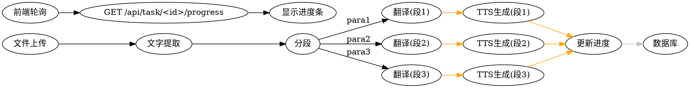

# 增量流水线并行 + 进度展示 设计文档

> **For agentic workers:** REQUIRED SUB-SKILL: Use superpowers:subagent-driven-development or superpowers:executing-plans to implement this design.

**Goal:** 优化大文档处理性能，支持边翻译边生成TTS，并实时展示处理进度

**Architecture:** 将同步串行流程改为增量流水线并行，翻译和TTS分段交叉执行，后端实时更新处理进度供前端展示

**Tech Stack:** Python/Flask/SQLite, Vue3/Element Plus, ThreadPoolExecutor

---

## 1. 现状分析

### 当前处理流程

```
文件 → 文字提取 → 全量翻译(等API) → 全部存入内存 → 分段 → 逐段TTS(串行) → 完成
```

### 性能瓶颈

1. **翻译环节** - 全量一次性翻译大文档，网络请求慢，内存占用高
2. **TTS生成环节** - 同步逐段生成，段落间串行等待
3. **无进度反馈** - 前端只能看到"处理中"，用户无法预估时间

---

## 2. 优化方案

### 2.1 核心架构变更

**新流程（增量并行）：**

```
文件 → 文字提取 → 分段
              ↓
        逐段翻译（流式，不阻塞）
              ↓
        并行TTS生成（ThreadPoolExecutor，多段同时）
              ↓
        每完成一段 → 更新数据库进度 → 前端轮询获取
```

### 2.2 进度追踪设计

#### 数据库变更

**files 表新增字段：**

```sql
ALTER TABLE files ADD COLUMN processed_segments INTEGER DEFAULT 0;
ALTER TABLE files ADD COLUMN total_segments INTEGER DEFAULT 0;
```

#### 后端API

**GET /api/task/<task_id>/progress**

```json
{
    "task_id": "xxx-xxx",
    "status": "processing",
    "files": [
        {
            "id": 1,
            "original_path": "xxx.pdf",
            "total_segments": 10,
            "processed_segments": 5,
            "status": "processing"
        },
        {
            "id": 2,
            "original_path": "xxx.docx",
            "total_segments": 8,
            "processed_segments": 8,
            "status": "completed"
        }
    ]
}
```

### 2.3 模块改动

#### modules/database.py

```python
# 新增函数
def update_file_progress(file_id: int, processed_segments: int):
    """更新文件已处理段落数"""
    with get_db_cursor() as cursor:
        cursor.execute(
            'UPDATE files SET processed_segments = ? WHERE id = ?',
            (processed_segments, file_id)
        )

def get_task_progress(task_id: str) -> dict:
    """获取任务进度信息"""
    task = get_task(task_id)
    files = get_files_by_task(task_id)
    return {
        'task_id': task_id,
        'status': task['status'],
        'files': [
            {
                'id': f['id'],
                'original_path': f['original_path'],
                'total_segments': f['total_segments'] or 0,
                'processed_segments': f['processed_segments'] or 0,
                'status': f['status']
            }
            for f in files
        ]
    }

# 修改现有函数
def create_file_record(task_id: str, original_path: str, total_segments: int = 0) -> int:
    """创建文件记录时初始化段落数"""
    # 新增字段：processed_segments=0, total_segments=total_segments
```

#### modules/translator.py

```python
class Translator:
    def translate_incremental(self, text: str) -> Generator[str, None, None]:
        """分段翻译，返回生成器"""
        # 按段落分割，逐段翻译并yield
        pass
```

#### modules/tts.py

```python
class TTSProcessor:
    def text_to_speech_parallel(self, segments: list, output_dir: str) -> list:
        """多线程并行生成MP3"""
        mp3_paths = []
        with ThreadPoolExecutor(max_workers=3) as executor:
            futures = []
            for i, segment in enumerate(segments):
                output_path = os.path.join(output_dir, f'segment_{i:04d}.mp3')
                future = executor.submit(self._generate_single, segment, output_path)
                futures.append((future, output_path))
            for future, path in futures:
                result = future.result()
                if result:
                    mp3_paths.append(path)
        return mp3_paths
```

#### modules/task_queue.py

```python
def process_task(self, task_id: str):
    # ... 文件提取和分段 ...

    paragraphs = [p.strip() for p in translated_text.split('\n\n') if p.strip()]

    # 更新总段落数
    update_file_segments(file_record['id'], len(paragraphs))

    # 增量翻译 + 并行TTS
    for i, para in enumerate(paragraphs):
        # 翻译
        translated = self.processors['translator'].translate_to_chinese(para)
        # TTS生成（后台执行）
        output_path = os.path.join(output_dir, f'segment_{i:04d}.mp3')
        executor.submit(self.processors['tts'].text_to_speech, translated, output_path)
        # 更新进度
        update_file_progress(file_record['id'], i + 1)

    # 等待所有TTS任务完成
    # ... 合并逻辑 ...
```

#### app.py

```python
# GET /api/task/<task_id>/progress - 获取任务处理进度
@app.route('/api/task/<task_id>/progress', methods=['GET'])
@verify_api_key
def get_task_progress(task_id):
    from modules.database import get_task_progress
    task = get_task(task_id)
    if not task:
        return jsonify({'error': 'Task not found'}), 404
    return jsonify(get_task_progress(task_id)), 200
```

#### frontend/src/api/index.js

```javascript
export const getTaskProgress = (taskId) => api.get(`/task/${taskId}/progress`)
```

#### frontend/src/views/TaskList.vue

```vue
<el-table-column prop="progress" label="进度" width="150">
  <template #default="{ row }">
    <el-progress
      v-if="row.status === 'processing'"
      :percentage="Math.round(row.processed_segments / row.total_segments * 100)"
      :text-inside="true"
      :stroke-width="12"
    />
    <span v-else>{{ getStatusLabel(row.status) }}</span>
  </template>
</el-table-column>
```

---

## 3. 数据流图



---

## 4. 文件结构

```
bookvoice/
├── app.py                           # 新增 GET /api/task/<id>/progress
├── modules/
│   ├── database.py                 # 新增 update_file_progress, get_task_progress, update_file_segments
│   ├── task_queue.py               # 增量流水线逻辑
│   ├── translator.py               # translate_incremental 方法
│   └── tts.py                      # text_to_speech_parallel 方法
└── frontend/src/
    ├── api/index.js                # 新增 getTaskProgress
    └── views/TaskList.vue         # 显示进度条
```

---

## 5. 配置项（可选）

```python
# config.py
TTS_PARALLEL_WORKERS = 3        # TTS并行线程数
TRANSLATION_BATCH_SIZE = 1      # 翻译批次大小（当前逐段翻译）
```

---

## 6. 测试计划

1. **单元测试**
   - `test_translator.py` - 测试增量翻译方法
   - `test_tts.py` - 测试并行生成方法

2. **集成测试**
   - 上传大文档，验证进度正确更新
   - 验证并行生成比串行快3-5倍

3. **前端测试**
   - 验证进度条正确显示
   - 验证处理完成后进度变为100%

---

## 7. 风险评估

| 风险 | 等级 | 缓解措施 |
|-----|-----|---------|
| 并行TTS占用过多系统资源 | 中 | 限制max_workers=3 |
| 翻译API限流 | 中 | 逐段请求，控制频率 |
| 数据库并发写入冲突 | 低 | SQLite支持并发读取，写入串行 |
| 前端轮询过于频繁 | 低 | 3-5秒轮询间隔 |

---

## 8. 后续扩展

- [ ] 支持WebSocket实时推送进度（替代轮询）
- [ ] 支持暂停/恢复任务
- [ ] 支持分布式worker处理
